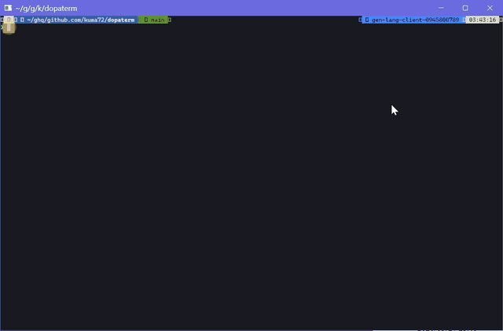

# dopaterm

GPU terminal emulator with input/output visual effects, written in Rust
(wgpu + glyphon + alacritty_terminal).



## Features

- Visual effects driven by input/output events: shatter on erase, cursor
  trail, fireworks, and more
- Lua effect plugins loaded from `<config dir>/dopaterm/effects/*.lua`
- Settings overlay (`F1`): toggle effect intensity and each effect, pick a
  system monospace font at runtime
- Mouse tracking (SGR / X10), including ConPTY bypass for native Windows
  console apps, `wsl.exe`, and `ssh.exe`
- Terminal-side text selection: drag to select, `Ctrl+Shift+C` to copy;
  inside mouse-aware applications `Shift`+drag selects at the terminal
  level and `Shift`+wheel scrolls history instead
- `Ctrl+Shift+V` pastes text (bracketed paste when the app enables it);
  a clipboard image is saved to a temp PNG and its path is pasted for CLI
  agents (`/mnt/c/...` when the shell is `wsl.exe`)
- File drag & drop inserts the file path (quoted when it contains spaces,
  `/mnt/c/...` for `wsl.exe`)
- IME input with preedit display and candidate window positioned at the
  cursor (Japanese input verified on Windows)
- Fullwidth / CJK correct rendering: per-cell backgrounds, scrollback, and
  a block cursor that covers both cells of a wide character

## Install

Prebuilt binaries for Windows, macOS (Apple Silicon / Intel), and Linux are
on the [Releases](https://github.com/kuwa72/dopaterm/releases) page.

Build from source:

```sh
cargo build --release
```

## Usage

```sh
dopaterm [--config FILE] [--shell CMD] [--calm|--max|--no-fx] [--debug-console]
```

- `--config FILE`: config file (default `<config dir>/dopaterm/config.toml`,
  see `config.sample.toml`)
- `--shell CMD`: shell to run
- `--calm` / `--max` / `--no-fx`: effect intensity preset
- `--debug-console` (Windows): attach to the parent console or open a new
  console window for log output; no console is shown otherwise
- `F1`: settings overlay (effect intensity, per-effect toggles, font next)

## License

Licensed under either of [Apache License, Version 2.0](LICENSE-APACHE) or
[MIT license](LICENSE-MIT) at your option.
